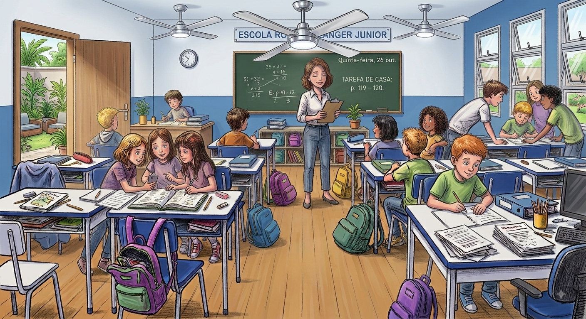
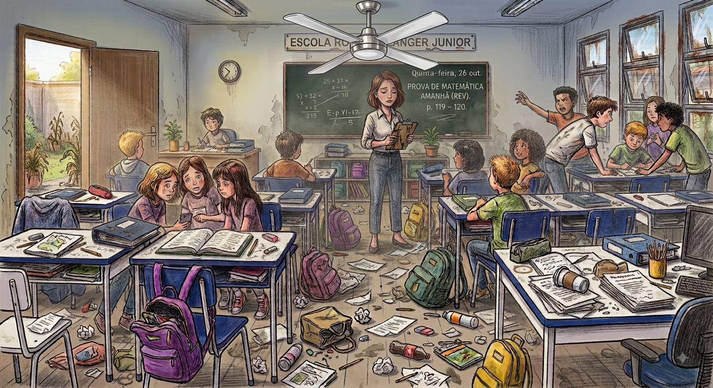
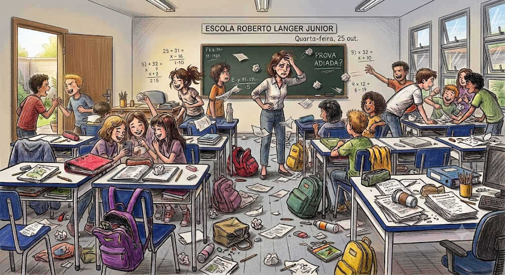
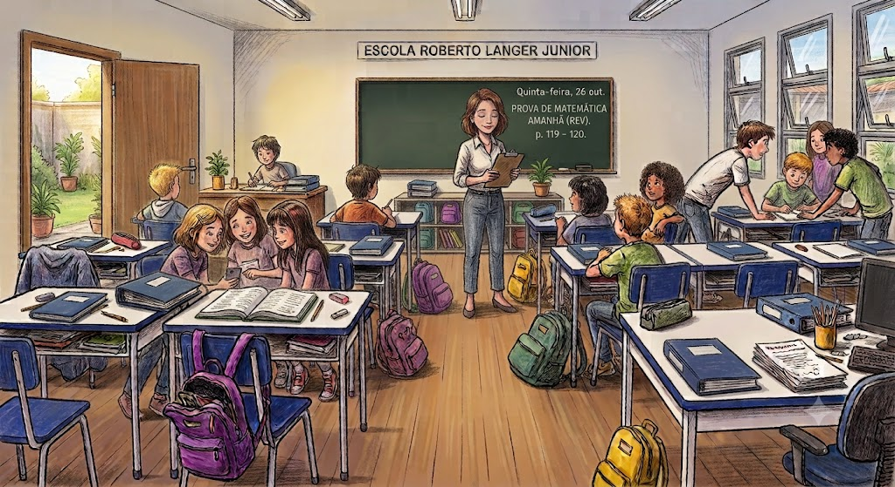

HTML
<!DOCTYPE html>
<html lang="pt-br">
<head>
    <meta charset="UTF-8">
    <meta name="viewport" content="width=device-width, initial-scale=1.0">
    <title>Game do Saber - Preservação Escolar</title>
    
</head>
<body>

    

        <!-- CABEÇALHO -->
        <header>
            

                🎮
                <h1>GAME DO SABER</h1>
            

            
NOSSA ESCOLA, NOSSO COMPROMISSO

        </header>

        <!-- BANNER DE DESTAQUE -->
        

            O QUE NÓS PODEMOS FAZER PARA TORNAR A NOSSA ESCOLA AINDA MELHOR?
        

        <!-- GALERIA DO PROJETO (4 CARDS EM GRID 2x2) -->
        <h2 class="titulo-secao">📸 Galeria do Projeto</h2>
        

            

                

                    
                

                
Antes: Ventilador Antigo

            

            

                

                    
                

                
Depois: Ventilador Novo

            

            

                

                    
                

                
Antes e depois: Manutenção

            

            

                

                    
                

                
Antes e depois: Conservação

            

        

        <!-- VÍDEOS -->
        

            <h2 class="titulo-secao">🎬 Vídeos e Recomendações</h2>
            

                

                    <iframe src="https://www.youtube-nocookie.com/embed/OzsfOLBmbkU" title="Cuidado com o Patrimônio Escolar" allowfullscreen></iframe>
                

                

                    <iframe src="https://www.youtube-nocookie.com/embed/HqFGprxZCwA" title="Conservação da Escola" allowfullscreen></iframe>
                

            

        

        <!-- AVALIAÇÃO INTERATIVA -->
        

            <h2 class="titulo-secao" style="justify-content: center;">⭐ Avalie o Nosso Projeto</h2>
            

                ★
                ★
                ★
                ★
                ★
            

            
Clique nas estrelas para avaliar!

        

        <!-- RODAPÉ -->
        <footer>
            O cuidado com o patrimônio da escola é responsabilidade de todos os estudantes e comunidade. 
            © 2026 Game do Saber.
        </footer>
    

    <!-- JAVASCRIPT DAS ESTRELAS -->
    

</body>
</html>